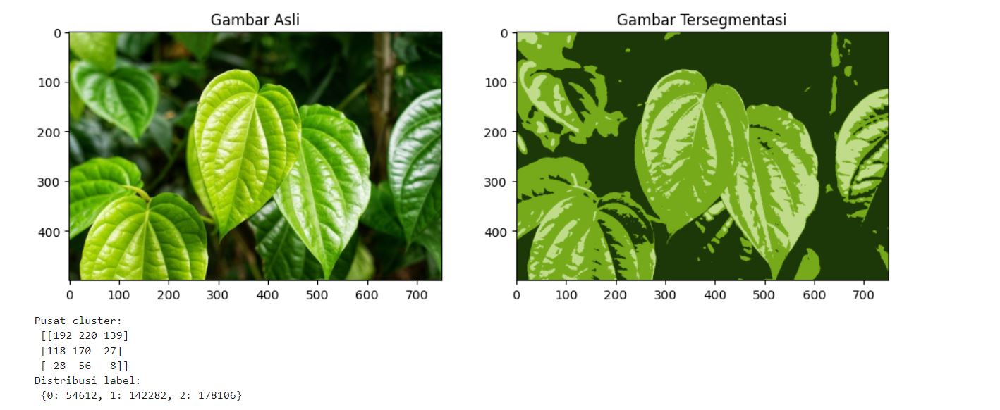

# UAS4_PengolahanCitra

# Image Segmentation with K-means Clustering

This project demonstrates image segmentation using the K-means clustering algorithm in Python. The code segments an image into different regions based on color similarity.

## Requirements

Ensure you have the following libraries installed:

- `numpy`
- `matplotlib`
- `opencv-python`

berikut Source code nya

```
import numpy as np
import matplotlib.pyplot as plt
import cv2

# Memuat gambar sesuai dengan yang dimiliki
image = cv2.imread('Downloads/daun.jpg')
if image is None:
    raise FileNotFoundError("File gambar tidak ditemukan. Periksa kembali jalur file.")

# Mengubah warna gambar menjadi RGB (dari BGR)
image = cv2.cvtColor(image, cv2.COLOR_BGR2RGB)

# Membentuk ulang gambar menjadi susunan piksel 2D dengan 3 nilai warna (RGB)
pixel_vals = image.reshape((-1, 3))

# Mengkonversikan tipe data ke float
pixel_vals = np.float32(pixel_vals)

# Menentukan kriteria agar algoritme berhenti berjalan: 100 iterasi atau epsilon 0.85
criteria = (cv2.TERM_CRITERIA_EPS + cv2.TERM_CRITERIA_MAX_ITER, 100, 0.85)

# Menentukan jumlah cluster (K)
k = 3

# Melakukan k-means clustering
retval, labels, centers = cv2.kmeans(pixel_vals, k, None, criteria, 10, cv2.KMEANS_RANDOM_CENTERS)

# Mengkonversi data pusat cluster menjadi nilai 8-bit
centers = np.uint8(centers)

# Memetakan label ke warna pusat cluster
segmented_data = centers[labels.flatten()]

# Membentuk ulang data menjadi dimensi gambar asli
segmented_image = segmented_data.reshape((image.shape))

# Menampilkan gambar asli dan gambar tersegmentasi dalam satu plot
plt.figure(figsize=(12, 6))

plt.subplot(1, 2, 1)
plt.imshow(image)
plt.title('Gambar Asli')

plt.subplot(1, 2, 2)
plt.imshow(segmented_image)
plt.title('Gambar Tersegmentasi')

plt.show()

# Menampilkan pusat cluster
print("Pusat cluster:\n", centers)

# Menampilkan distribusi label
unique_labels, counts = np.unique(labels, return_counts=True)
print("Distribusi label:\n", dict(zip(unique_labels, counts)))
```

## output


